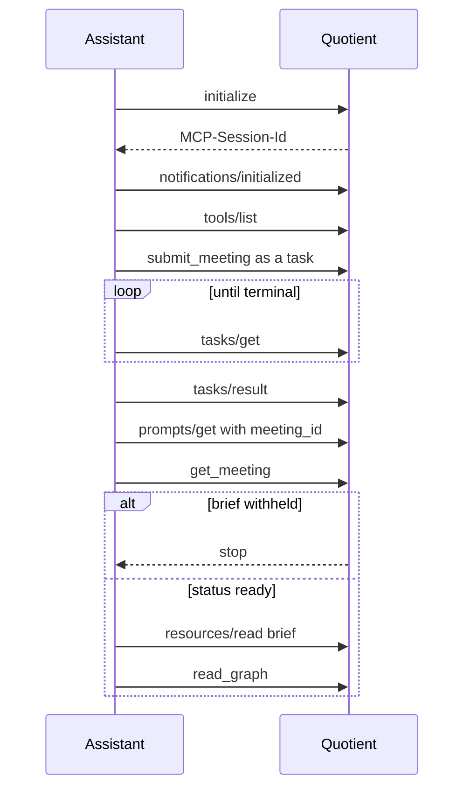

# Quotient MCP

This document is the partner contract for Quotient. The protocol revision is **2025-11-25**. The transport is Streamable HTTP. Partners and the Quotient portal use this server. There is no partner REST API for meetings.

Internal model prompts and JSON Schemas under `contracts/` are not part of this contract. They are not MCP prompts, they are not listed by `prompts/list`, and this server does not return their text.

Specification: [MCP 2025-11-25](https://modelcontextprotocol.io/specification/2025-11-25).

## Endpoint

| Item | Value |
| --- | --- |
| MCP URL | `{origin}/mcp` |
| Methods | `POST`, `GET`, `DELETE`, `OPTIONS` |
| Protocol header | `MCP-Protocol-Version: 2025-11-25` |
| Session header | `MCP-Session-Id` |
| POST `Accept` | `application/json` and `text/event-stream` |
| POST `Content-Type` | `application/json` |
| GET `Accept` | `text/event-stream` |

`POST /mcp` carries one JSON-RPC 2.0 message. A JSON array is rejected. Notifications and client responses receive HTTP 202 with an empty body. Requests receive either one JSON object (`application/json`) or an SSE stream (`text/event-stream`).

`GET /mcp` opens the server-to-client SSE stream for that session. Events use `event: message` and a numeric `id`. A client may resume with `Last-Event-ID`. The server keeps a short buffer; a client that cannot resume polls instead.

`DELETE /mcp` ends the session.

The local default origin is `http://127.0.0.1:8080`. Set `QUOTIENT_RESOURCE_URL` to the canonical MCP URL, including the `/mcp` path. That value is the OAuth resource indicator.

Protected resource metadata, unauthenticated:

- `GET /.well-known/oauth-protected-resource`
- `GET /.well-known/oauth-protected-resource/mcp`

## Authorization

Quotient is an OAuth 2.1 resource server. Amazon Cognito, in `ap-southeast-2`, is the authorization server. The API's own request handling never reads Bedrock credentials and does not accept a client secret; in the local build the worker runs in-process and uses the machine's AWS credentials for model calls.

Partners:

1. Call `/mcp` without a token and read `WWW-Authenticate`.
2. Fetch the protected-resource metadata URL from `resource_metadata`.
3. Discover the Cognito authorization server from `authorization_servers` (RFC 8414, then OpenID Connect discovery if needed).
4. Authorize with PKCE `S256`. Send the `resource` parameter (RFC 8707) on both the authorization request and the token request. Its value is the `resource` field of the metadata document, which is the canonical MCP URL.
5. Call `/mcp` with `Authorization: Bearer <access token>`. Tokens in the query string are ignored.

The metadata document contains:

- `resource`: canonical MCP URL
- `authorization_servers`: one Cognito issuer, `https://cognito-idp.ap-southeast-2.amazonaws.com/<userPoolId>`
- `bearer_methods_supported`: `["header"]`
- `scopes_supported`: `["quotient:meetings"]`
- `resource_name`: `Quotient`

Until `QUOTIENT_AUTHORIZATION_SERVER` (or the CDK deployment variable `COGNITO_ISSUER`) is set, metadata advertises `https://cognito-idp.ap-southeast-2.amazonaws.com/unconfigured`. Replace that with the staging user-pool issuer before any non-local deployment. Configure the canonical MCP URL with `QUOTIENT_RESOURCE_URL` or `MCP_RESOURCE_URL`. Configure `QUOTIENT_OAUTH_CLIENT_IDS` or `COGNITO_CLIENT_ID` when access tokens do not contain a resource `aud` claim.

The scope challenged on HTTP 401 is `quotient:meetings`. A token that verifies but lacks that scope receives HTTP 403 and `error="insufficient_scope"`.

### Token check in this build

The API verifies Cognito access tokens against the configured user-pool JWKS using RS256, exact issuer matching, expiration and issue-time checks, and `token_use=access`. A token with `aud` must target the canonical MCP resource URL. A token without `aud` must have a `client_id` in `QUOTIENT_OAUTH_CLIENT_IDS` (or the CDK variable `COGNITO_CLIENT_ID`). The API then enforces the `quotient:meetings` scope. An unset or `unconfigured` issuer fails closed; it never accepts bearer tokens.

### Local bypass

`QUOTIENT_AUTH_BYPASS` defaults to off. The values `1`, `true`, and `yes` enable a single local principal:

| Field | Value |
| --- | --- |
| subject | `local-dev` |
| client id | `quotient-local-bypass` |
| scope | `quotient:meetings` |

Every bypassed caller shares that subject, so tasks are not isolated from each other. The flag is ignored when `QUOTIENT_ENVIRONMENT` is `staging` or `production`. Leave the flag unset except on a developer machine.

`QUOTIENT_ALLOWED_ORIGINS` is a comma-separated list of browser origins allowed to call the server. A missing `Origin` header is accepted for non-browser MCP clients.

## Session and initialize

`initialize` is the only request that omits `MCP-Session-Id`. The response identity is:

- `protocolVersion`: `2025-11-25` (this server answers with this revision even when the client offers an older one; a client that cannot speak it disconnects)
- `serverInfo.name`: `quotient`
- `serverInfo.title`: `Quotient`
- `serverInfo.version`: `0.1.0`
- `instructions`: call `submit_meeting` as a task, read the brief resource for published findings, leave the review queue out of any answer, and do not expect model credentials
- capabilities: `tools` (`listChanged` false), `resources` (`subscribe`, `listChanged`), `prompts` (`listChanged` false), `tasks` with `tasks.list`, `tasks.cancel`, and `tasks.requests.tools.call`

The response sets `MCP-Session-Id`. Every later request on that session sends the session header and `MCP-Protocol-Version: 2025-11-25`. The client then sends `notifications/initialized`. Other requests before that notification receive JSON-RPC `-32600`.

The session is bound to the authorization subject. A different subject on the same session receives HTTP 403. An unknown session id receives HTTP 404.

## External client

An assistant outside this portal calls the canonical MCP URL. Locally that is `http://127.0.0.1:8080/mcp`. Set `QUOTIENT_RESOURCE_URL` to that URL, including `/mcp`. When the variable is unset, the server uses the local default. The portal's same-origin `/mcp` is a browser path. It is not the partner address.

`initialize` is a JSON-RPC request with `protocolVersion` `2025-11-25` and `clientInfo`. It omits `MCP-Session-Id`. Every later request sends `MCP-Session-Id` from the initialize response and `MCP-Protocol-Version: 2025-11-25`. The next call is `notifications/initialized`. Other methods before that notification receive JSON-RPC `-32600`.

Minimal sequence:

1. `initialize`.
2. `notifications/initialized`.
3. `tools/list`.
4. `tools/call` `submit_meeting` with `params.task`. A call that omits the task receives `-32601`.
5. Poll `tasks/get` until the task is terminal. Read `tasks/result` for `meeting_id`.
6. `prompts/get` for `brief_this_meeting`, `open_questions`, and `proposed_actions`. Each requires `meeting_id`.
7. `get_meeting`. If `status` is not `ready`, or `quotient://meetings/{meeting_id}/brief` has `withheld` true, stop. The brief is withheld.
8. Otherwise `resources/read` that brief, and `read_graph` for playback paths.

Leave unresolved, contradicted, and numeric-failed claims out of the answer. They stay in the review resource.



## Tools

`tools/list` returns the ten tools below. Each description is safe to show before consent. `execution.taskSupport` is `required` or `forbidden`. Annotations are hints: `readOnlyHint`, `destructiveHint`, `idempotentHint`, and `openWorldHint`. `openWorldHint` is false for every tool. `destructiveHint` is false except on `cancel_meeting`, where the spec default would otherwise treat the tool as destructive.

A `forbidden` tool invoked with `params.task` returns `-32601`. `submit_meeting` invoked without `params.task` returns `-32601`.

Playback paths in tool results use `meetings/{meeting_id}?t={start_ms}`.

### `submit_meeting`

`taskSupport`: `required`. Not read-only. Not destructive.

Starts analysis of one object already stored in the Quotient media bucket.

| Argument | Required | Meaning |
| --- | --- | --- |
| `object_key` | yes | Storage key. Not a speaker name and not an action owner. |
| `upload_complete` | no | `false` while the multipart upload is still open. |
| `context_names` | no | Up to 32 short strings (64 characters each) forwarded to the worker as context. They are not written onto the transcript. |
| `idempotency_key` | no | Same key and same authorization subject return the same meeting. |
| `filename`, `media_type`, `byte_size` | no | Describe the file when `object_key` is empty. `media_type` must be `audio/*` or `video/*`; `byte_size` is capped at 5 GB. |
| `context_batch` | no | Batch id from `prepare_context` whose files were uploaded. Only the caller's own batch is accepted; an unknown or foreign batch fails the task before anything starts. |
| `purpose` | no | At most 2000 characters: what the meeting is about, in the person's words. |

The call returns a task, not the finished graph. Poll `tasks/get`, then read `tasks/result`. While the task is running, `statusMessage` is `Meeting {meeting_id} is {status}.` after the object is accepted. An empty `object_key` or `upload_complete: false` moves the task to `input_required`. The server sends `elicitation/create` (`mode: form`) asking for `object_key` and `upload_complete`. When object storage is configured the elicitation also carries `params.upload` = `{upload_url, method: "PUT", headers, object_key}`: a short-lived (15 minute) signed PUT for a key the server chose (`uploads/{task_id}/{file name}`). Upload the file to `upload_url` with those headers, then answer the elicitation with `upload_complete: true`. The server analyses the key it issued, not one echoed back, and only after the stored object exists and is not empty; otherwise it asks again (three times, then the task fails). Without object storage (command-line use) the previous contract holds: name a completed `derivatives/` key. Keys outside `uploads/{task_id}/` and `derivatives/` are not issued to browsers. Respond on `POST /mcp` with the matching JSON-RPC id. Declining, cancelling, or leaving the upload incomplete ends the task as `failed`.

`tasks/result` for a finished submission is a tool result. `structuredContent` contains `meeting_id`, `status`, `prompt_release`, `review_counts`, `artifacts`, `playback`, and `withheld`. It does not contain claim text. The client does not upload a raw transcript, and `submit_meeting` has no transcript argument. `raw_transcript` is not in this task result. The worker produces it. `read_graph` and the graph resource return it.

**Context.** Reference material (the `purpose` and the files of `context_batch`) is converted to Markdown by the worker before analysis, and the digest and reviewer passes receive an index of it (document names, headings, a short opening gist) and can open a document on demand with an internal `read_context` tool. It is reference only: it is never cited as evidence, never counts as something said in the meeting, and an instruction written inside it is ignored. `get_meeting` and the meeting resource report it additively as `context`: `{purpose, items: [{name, status (pending | ready | skipped | failed), reason, chars, summary}]}`. Storage keys and batch ids are never returned. A file that cannot be read is reported with a plain reason and the meeting carries on without it.

### `get_meeting`

`taskSupport`: `forbidden`. Read-only.

Arguments: `meeting_id`.

Returns `status`, `prompt_release`, `review_counts` (`unresolved`, `contradicted`, `numeric_failed`), `artifacts` (`ledger`, `claims`, `counterevidence`, `entailment`, `coverage`, `exports`), `playback`, and `withheld`, plus additive `progress_message`, `updated_at`, `source_name`, `headline` and `failure_message` when present. No transcript and no claim wording.

Meeting status is `queued`, `working`, `ready`, `needs_review`, `cancelled`, or `failed`. A stored `ready` job that still has review items or a speech span with neither a published citation nor an omission is reported as `needs_review`.

### `read_graph`

`taskSupport`: `forbidden`. Read-only.

Arguments: `meeting_id`, optional opaque `cursor`.

Returns one page of `spans`, `claims`, `findings`, `synthesis`, `actions`, `disagreements`, `omissions` and `gaps` (50 rows per collection). Shared metadata (`raw_transcript`, `dimensions`, `charts`, `synthesis_omissions`, `dissent_omissions`, `digest`, and `captions`) appears on the first page only. `playback` points at the resource `quotient://meetings/{id}/media`.

Additive fields (existing clients can ignore them):

- Each claim carries `confidence`: `confirmed` (both checks agree; the same set as `status: supported`), `likely` (the quote is verbatim in one span, at least one check says it follows, and none says it does not), `contradicted`, or `unverified`. `status` and the brief are unchanged: only `confirmed` claims reach the brief resource.
- `dimensions` rows have `state` `findings`, `none_in_transcript` (a lens looked and found nothing), or `not_evaluated` (the lens did not complete; a meeting with one cannot be `ready`). `none_in_transcript` rows carry `held_findings`, the number of findings for that topic left out because their claims were not confirmed.
- `digest` is the walkaway for a person who did not attend, or `null` for a meeting analysed before it existed. Shape: `content_type`, `title`, `summary[]`, `outcome`, `speakers[]` (only names the transcript itself gives), `chapters[]` (time ranges), `decisions[]`, `actions[]` (`assignee` is a voice id), `open_questions[]` (with `answered`, `answer`, `answer_ms`), `disagreements[]`, `perspectives[]`, `key_figures[]`, `risks[]`, `concepts[]`, and an optional `diagram` (a sanitised Mermaid flowchart or sequence). Every item cites span ids and has a `start_ms` taken from those spans; items that rest on claims have `basis` `confirmed` or `likely`. Free text can mention a voice by its id (for example `spk_2`); `speakers[]` maps an id to a name only when the transcript itself names that voice, so an unmapped id means an unnamed speaker, never a guessed name. The server also removes clauses that describe the transcript's own lines and any decision that only recounts the past. The server re-checks every citation against this graph before returning it. It is also what the `brief.html` and `brief.pdf` downloads render.
- `captions` is a `quotient://meetings/{id}/exports/captions.vtt` URI when the meeting has speech. Cues are at most two lines of 42 characters; a long span is split and its time shared by length; a cue falls back to `raw_text` when an edited `text` is empty. `raw_transcript.audio` joins span `raw_text` with newlines in `start_ms` order. `raw_transcript.video` joins Pegasus observation statements the same way. Each span includes `raw_text` (audio transcription) and `text` (synthesized transcript). Citations that resolve include `start_ms`, `end_ms`, and `playback`.

This graph is the system of record. It may contain unpublished claims. The brief is the published projection.

### `read_span`

`taskSupport`: `forbidden`. Read-only.

Arguments: `meeting_id`, `span_id`.

Returns one span, including `raw_text` and `text`. `raw_text` is the audio transcription and stays as first written. `text` is the synthesized transcript and may differ after a human edit. Also returns times, `coarse`, `overlap`, `speaker_hypothesis_id`, `speaker_display`, and `playback`.

### `accept_action`

`taskSupport`: `forbidden`. Not read-only. Not destructive. Idempotent when the action is already accepted.

Arguments: `meeting_id`, `action_id`.

Moves `acceptance` from `proposed` to `accepted`. Does not set an owner. The returned action has `owner_display`: the text of `owner_span_id`, or `not stated`.

### `revise_speaker`

`taskSupport`: `forbidden`. Not read-only. Not destructive.

| Argument | Required | Meaning |
| --- | --- | --- |
| `meeting_id` | yes | Meeting id |
| `span_id` | yes | Anchor span |
| `scope` | yes | `span` or `hypothesis` |
| `display_name` | yes | Human label, at most 128 characters |

`span` updates the anchor and detaches it onto a new hypothesis id. `hypothesis` updates every span that shares the anchor's hypothesis id. This is a transcript presentation edit; it does not rerun analysis, change meeting status, or alter `raw_text`. A `hypothesis` rename is also stored as a lock on that voice (`speaker_names` on the meeting), so the name is reapplied if the recording is analysed again.

### `prepare_context`

`taskSupport`: `forbidden`. Not read-only. Not destructive. Not idempotent (each call reserves a new batch).

| Argument | Required | Meaning |
| --- | --- | --- |
| `files` | yes | 1 to 20 entries: `filename` (required, with extension, at most 200 characters), `media_type`, `byte_size` |

Reserves one signed upload target per file for reference material the analysis may read (design documents, slides, spreadsheets, notes). Returns `batch_id` and `uploads`, each with `index`, `filename`, `upload_url`, `method` (`PUT`), `headers` (send exactly these) and `object_key` (`context/<batch>/<n>-<name>`, minted by the server). Supported extensions: `.pdf .docx .pptx .xlsx .xls .csv .json .xml .html .htm .md .markdown .txt .epub`. Limits: 25 MB per file, 100 MB in all. Images, audio, video and archives are refused. After uploading, pass `batch_id` to `submit_meeting` as `context_batch`. A batch belongs to the caller and expires after six hours. Without object storage the tool returns an error.

### `merge_speakers`

`taskSupport`: `forbidden`. Not read-only. Not destructive. Idempotent.

| Argument | Required | Meaning |
| --- | --- | --- |
| `meeting_id` | yes | Meeting id |
| `span_id` | yes | Anchor span; its voice is kept |
| `other_span_id` | yes | A span of the voice to fold into the anchor's voice |
| `display_name` | yes | Name for the merged voice |

Use only when a person confirms the two voices are one speaker. It updates the transcript presentation immediately; it does not rerun analysis or alter `raw_text`.

### `revise_text`

`taskSupport`: `forbidden`. Not read-only. Not destructive.

Arguments: `meeting_id`, `span_id`, `text` (at most 20,000 characters).

Updates the synthesized transcript text on one span. The original `raw_text` is preserved. It does not rerun analysis or change meeting status.

### `cancel_meeting`

`taskSupport`: `forbidden`. Destructive. Idempotent when the meeting is already cancelled.

Arguments: `meeting_id`.

Cancels the meeting and any in-flight submission task for it. The brief stays withheld.

Unknown meetings and unknown actions surface as tool results with `isError: true`, not as a different authorization error. A meeting owned by another subject is indistinguishable from a missing meeting.

## Resources

`resources/templates/list` returns:

| Template | URI |
| --- | --- |
| Graph | `quotient://meetings/{id}/graph` |
| Brief | `quotient://meetings/{id}/brief` |
| Review | `quotient://meetings/{id}/review` |
| Export | `quotient://meetings/{id}/exports/{name}` |

`resources/list` returns concrete URIs for meetings in the caller's authorization context. `resources/subscribe` and `resources/unsubscribe` are supported. Updates are `notifications/resources/updated`. A new meeting emits `notifications/resources/list_changed` on the session SSE stream.

`resources/read` returns JSON text for the graph, brief, and review. The graph object includes `raw_transcript` (`audio` and `video`) and, on every span, `raw_text` and `text`. The brief does not include `raw_transcript`.

Export `name` is one of:

| Name | Media type | Produced by |
| --- | --- | --- |
| `graph.json` | `application/json` | API projection of the graph |
| `brief.html` | `text/html` | API projection of the brief |
| `brief.pdf` | `application/pdf` | API projection, unless the worker port returns bytes |
| `actions.csv` | `text/csv` | API projection of actions |
| `actions.xlsx` | spreadsheet | API projection, unless the worker port returns bytes |
| `captions.vtt` | `text/vtt` | API, from speech spans on the source clock |
| `captions.srt` | `application/x-subrip` | API, from speech spans on the source clock |
| `burned.mp4` | `video/mp4` | Worker only |

Captions use each speech span's `text` and its `start_ms` / `end_ms`, including spans omitted from model payloads. `burned.mp4` reads as JSON-RPC `-32002` (`Export is not ready`) until the worker supplies bytes. Captions are split into cues of at most two 42-character lines (see `read_graph`). `brief.html` and `brief.pdf` render the digest when the meeting has one (confirmed and likely items, each with its time); otherwise a withheld brief still has HTML and PDF artifacts that state the brief is withheld, or a partial brief of confirmed sentences, and never include unpublished claim text. The `brief` resource itself is unchanged: it is withheld until the meeting is `ready`.

Action exports use `owner_display`. They do not have an owner-name column. A relative due date with no `anchor_date` has an empty ISO date.

## Prompts

These three MCP prompts are the skills an external assistant should load with `prompts/get`. They tell the client which tools to call. They are not model system prompts.

| Name | Purpose |
| --- | --- |
| `brief_this_meeting` | Read `get_meeting`, then start from the `read_graph` `digest`. Stop when the brief is withheld. Mark `likely` items as likely. |
| `open_questions` | List the `digest.open_questions` that are unanswered. Fall back to question findings when the digest is null. |
| `proposed_actions` | List `digest.actions` and graph actions whose `acceptance` is `proposed`. Keep that label. Use `owner_display`. |

Each prompt takes `meeting_id`. Each one tells the client to leave unresolved, contradicted, and numeric-failed claims out of the answer. The review resource is a queue, not the brief.

## Tasks

The server accepts task-augmented `tools/call` only for `submit_meeting`.

Create parameters: `params.task.ttl` in milliseconds. Default `3600000` (1 hour). Minimum `1000`. Maximum `86400000` (24 hours). Values outside that range are clamped. The response always includes the effective `ttl` and `pollInterval` (`1000`). The task starts in `working`.

| Method | Behavior |
| --- | --- |
| `tasks/get` | Current task object for this subject. |
| `tasks/list` | Tasks for this subject, cursor page of 50. |
| `tasks/result` | Tool result when terminal. Includes `_meta["io.modelcontextprotocol/related-task"]`. If the task is not terminal, the response is an SSE stream that waits for a terminal status. While `input_required`, that stream also carries `elicitation/create`. |
| `tasks/cancel` | Moves a non-terminal task to `cancelled` and cancels the meeting. |

Status path: `working` → `input_required` → `working` → `completed`, `failed`, or `cancelled`. Terminal states do not change. Cancelling a terminal task returns `-32602`.

At most 8 non-terminal tasks per authorization subject. A further create returns `-32603`.

Progress uses `notifications/progress` when the original call sent `_meta.progressToken`. Task status changes use `notifications/tasks/status`. Both are best-effort on the session SSE stream. Clients poll `tasks/get`.

A task id from another subject, an unknown id, and an expired task all return `-32602`. The message for a foreign task matches a missing task.

When the meeting reaches `ready` or `needs_review`, the submission task becomes `completed`. `needs_review` is a finished gate result: the brief is withheld. `failed` and `cancelled` are the other terminal meeting outcomes; the task then ends `failed` or `cancelled`.

## Errors

Transport:

| HTTP | When |
| --- | --- |
| 401 | Missing bearer token, or stub verifier rejected the token. `WWW-Authenticate` includes `resource_metadata` and `scope`. |
| 403 | Origin not allowed, subject does not match the session, or scope is insufficient. |
| 400 | Bad JSON, batch body, missing session, or wrong protocol version. |
| 404 | Unknown `MCP-Session-Id`. |
| 406 | `Accept` does not include the required media types. |
| 204 | `DELETE /mcp`. |
| 202 | Notification or client JSON-RPC response. |

JSON-RPC, carried on HTTP 200 after the session exists:

| Code | When |
| --- | --- |
| `-32700` | Body is not JSON. |
| `-32600` | Invalid request, or a call arrived before `notifications/initialized`. |
| `-32601` | Unknown method; `submit_meeting` without a task; any other tool with a task. |
| `-32602` | Invalid params, unknown tool name, unknown prompt, bad cursor, unknown or foreign task, cancel of a terminal task. |
| `-32603` | Internal error, or the per-subject task limit. |
| `-32002` | Unknown resource, or `burned.mp4` not rendered yet. |

Tool failures for a known meeting operation (`Meeting not found.`, and the same for a span or action) are `CallToolResult` with `isError: true`.

## Withheld from partners

Quotient does not return:

- A Bedrock credential, AWS secret, or model API key.
- An invented owner. Actions expose `owner_span_id` and `owner_display`. `owner_display` is the span text, or `not stated`.
- A published unresolved, contradicted, or numeric-failed claim. Those claims stay in `quotient://meetings/{id}/review` and in the graph. They are absent from the brief. A ready job that still contains them is reported as `needs_review`, and the brief is withheld.
- The text of `contracts/prompts` or `contracts/schemas`. `prompt_release` is a short version label. A value with a newline or longer than 128 characters is omitted.

The graph resource remains the system of record and can show unpublished claims to a caller that already holds the meeting. Partner prompts require the client to keep those claims out of the answer it writes.

## Limits

| Limit | Value |
| --- | --- |
| Protocol | `2025-11-25` only on requests after initialize |
| Request body | 1,000,000 bytes |
| Task TTL | 1 second to 24 hours, default 1 hour |
| Concurrent tasks | 8 per authorization subject |
| Graph page | 50 rows per collection |
| `context_names` | 32 strings, 64 characters each |
| Object key | At most 1024 ASCII characters, no `..` and no leading slash |

## Local process

From the repository root, with the bypass flag only on a developer machine:

```sh
QUOTIENT_AUTH_BYPASS=1 uvicorn quotient.app:create_app --factory --app-dir apps/api --host 127.0.0.1 --port 8080
```

The memory ledger records the meeting as `queued` and does not run the model loop. When `apps/worker` exposes `load_port()`, the server calls that port for submit, status, speaker edits, accepted actions, cancel, and export bytes. Analysis, entailment, and burned-in video stay in the worker.
