# Quotient

Quotient turns a recorded meeting or call into a written brief, a set of evidence-linked findings and follow-up actions. Every statement it publishes points to the moment in the recording where it was said. Statements it cannot confirm are held back for review rather than presented as fact.

> **Status: pre-release.** Quotient runs end to end on a local machine. It is not deployed, and it is not yet ready for production use. Read [Known limitations](#known-limitations) before using it.

**Contents**

- [Known limitations](#known-limitations)
- [How it works](#how-it-works)
- [Repository layout](#repository-layout)
- [Prerequisites](#prerequisites)
- [Quick start (local)](#quick-start-local)
- [Configuration](#configuration)
- [Running the tests](#running-the-tests)
- [MCP integration](#mcp-integration)
- [Data handling and privacy](#data-handling-and-privacy)
- [Security](#security)
- [Operations and troubleshooting](#operations-and-troubleshooting)
- [Deployment](#deployment)
- [Quality evidence](#quality-evidence)
- [Documentation](#documentation)
- [Contributing](#contributing)
- [Ownership and licence](#ownership-and-licence)

---

## Known limitations

These limits come from the code and from the recorded evaluations in [docs/quality-ledger.md](docs/quality-ledger.md). They are listed first because they decide what the software can be used for today.

| Area | Limitation |
| --- | --- |
| Media ingestion | Browser uploads work: the API issues a signed upload URL for `uploads/{task_id}/...`, the portal PUTs the file, and the worker downloads it before analysis. Files placed in `derivatives/` still work for command-line use. Each file is one recording; slides and notes picked alongside it are not yet analysed. |
| Deployment | The AWS staging stack synthesises but has not been deployed. It creates DynamoDB tables that no application code uses. |
| Meeting state | Locally, meetings are kept in `.local/run/meetings.json`. Outside local mode they are kept only in process memory and are lost on restart. |
| Completeness | Independent evaluators scored the walkaway's completeness 3 of 5 on the recordings tested (see [Quality evidence](#quality-evidence)): the main threads are covered, detail and some positions are missed. Every meeting still ends `needs_review`, because the unanimity rule leaves roughly half of all statements unconfirmed. |
| Speakers | Voices are separated automatically (pyannote 3.1, local) and shown as "Speaker N" until a name is given in the recording or typed by a person. The diarizer can merge two people or split one (it split one congressman into two voices on a hearing), and a voice is named only when the transcript itself names it. |
| Context | **+ Context** on the Start-a-meeting card opens a panel where a person pastes text or adds files (PDF, Word, PowerPoint, Excel, CSV, JSON, HTML, XML, EPUB, Markdown, text; 20 items, 25 MB each, 100 MB in all) and says what the meeting is about. Files are converted to Markdown locally with Microsoft MarkItDown in its own environment (`scripts/setup-context.sh`; without it only text, Markdown, CSV and JSON are read). The walkaway agents see an index and can open a document on demand. It is reference only: never cited as evidence and never treated as what was said, and instructions inside it are ignored. Bad or unreadable files are skipped with a reason and never stop the meeting. |
| Portal views | Overview (the walkaway), **Insights** (charts: who carried the conversation, talk time and pace over time, topic length by speaker, outcomes on a timeline, running totals of questions, answers, decisions and actions, how well statements held up, who answered whom; every chart plays that moment and a legend click focuses one voice), Transcript, and Evidence. A person can rename a voice (pencil) from "Who spoke" or "Who argued what"; the name is stored on the meeting, reapplied if it is analysed again, and used in every view and in exported briefs. A name is keyed to the diarizer's voice id, so it stays correct only while re-analysis produces the same voices. |
| Long recordings | Transcription runs in real time (about six minutes of audio per segment) and needs valid AWS credentials for the whole run. An 84-minute recording failed at 54 minutes because the local AWS session expired. A full long-recording run has not completed. |
| Content types | The walkaway adapts to the kind of recording (meeting, presentation, lecture, discussion, interview, other): lectures get explained concepts and worked examples, hearings and panels get who-argued-what, and outside an ordinary meeting an action needs a named owner who agreed it or said it themselves. The evidence lenses (decisions, commitments, risks) are still meeting-shaped. |
| Provider filtering | Amazon Bedrock's content filter rejects some audio. Quotient keeps the rest of the meeting and names the rejected part as "Not transcribed". |
| Licence | No licence has been granted. See [Ownership and licence](#ownership-and-licence). |

---

## How it works

You give Quotient a recording. It transcribes the audio, extracts statements, checks each statement against the exact words in the recording, and then writes the brief from statements that passed.

Principles that the code enforces:

- **Every published statement cites its source.** A citation is accepted only when its quote appears verbatim in one speech span. This is checked when a citation is created and again when the graph is read.
- **Unconfirmed statements stay out of the brief.** A statement is confirmed only when its quote resolves to one speech span, the counter-search examines every span it opens, no contradiction is found, both entailment checks agree, and any figures in the statement appear in the cited span. Anything else is held for review.
- **Absence is stated only when it is known.** "Not mentioned in the video" appears only when a topic was analysed and nothing was found, with nothing unconfirmed or missing.
- **Failures are named, not hidden.** A rejected or unreadable part of a recording is reported as a gap, not silently treated as silence.
- **Owners are not invented.** An action's owner is the text of the transcript span that names them, shown as what was said. If no span names an owner, the action says "not stated".

### Pipeline

```mermaid
flowchart LR
    A["Recording: upload or derivatives/"] --> B["Probe and extract 16 kHz PCM"]
    B --> C["Speech and silence timeline"]
    C --> D["Transcribe with Amazon Nova Sonic"]
    C --> D2["Separate voices (local pyannote)"]
    D --> E["Compact and extract statements"]
    D2 --> E
    E --> F["Check each statement: quote, counter-search, two entailment checks"]
    F --> G["Coverage audit: every speech span accounted for"]
    G --> H["Ten evidence lenses"]
    H --> I2["Walkaway: summary, decisions, actions, topics, figures"]
    I2 --> R2["Reviewer pass re-reads the transcript against the draft"]
    R2 --> Q2["Answer check on every question"]
    Q2 --> I["Brief, actions and charts"]
    I --> J{"Publish gate"}
    J -->|"all checks pass"| K["ready"]
    J -->|"anything held"| L["needs_review"]
```



A meeting is `ready` only when every statement is confirmed, all speech is accounted for, no part is missing, and every evidence lens has been evaluated. Otherwise it is `needs_review`: the portal shows the confirmed brief, labelled as partial, and lists what is waiting for review.

### Meeting states

| State | Meaning |
| --- | --- |
| `queued` / `working` | Analysis is running. |
| `ready` | Complete. The full brief is published. |
| `needs_review` | Finished with held items. The brief is partial. |
| `failed` | Stopped with a plain-language reason. |
| `cancelled` | Stopped by a user. Model calls stop. |

---

## Repository layout

| Path | Contents |
| --- | --- |
| `apps/api/` | MCP server (Starlette, Streamable HTTP, protocol 2025-11-25) and the export renderers. |
| `apps/worker/` | Analysis pipeline: media, Sonic transcription, reasoning, quality loop, publish rules. Also the local port the API calls. |
| `apps/web/` | Portal (Next.js 15, React 19). Meeting workspace, settings, assistant connections. |
| `contracts/` | Prompt and JSON Schema contracts plus `registry.json`. These are internal; the MCP server does not return their text. |
| `infra/cdk/` | AWS CDK application for the staging stack. Synthesis only. |
| `scripts/` | Local launchers: `start-local.sh`, `start-local-minio.sh`, `stop-local.sh`, `bench_meeting.py`. |
| `tests/` | Worker, API, contract and JEV tests. Web tests live in `apps/web/tests/`. |
| `docs/` | Local development, staging, and the quality ledger. |
| `MCP.md` | The partner contract for the MCP server. |
| `derivatives/` | Local media (git-ignored). |
| `.local/` | Runtime state, logs and caches (git-ignored). |

---

## Prerequisites

Versions below are the ones this repository was run with. Newer versions are likely to work but are not tested.

| Tool | Used for | Tested with |
| --- | --- | --- |
| Python | API, worker, tests | 3.14.6 (`apps/api` declares `>=3.11`) |
| Node.js and npm | Portal | Node 26.0.0, npm 11.12.1 (Next.js 15 needs Node 20 or newer) |
| ffmpeg and ffprobe | Media probing, audio extraction, captions | ffmpeg 8.1.2 |
| AWS CLI v2 | Credentials for Amazon Bedrock; presigned playback URLs | 2.36.17 |
| Docker | Optional: a local MinIO container for playback | 29.5.3 |

You also need AWS credentials with Amazon Bedrock access in the `ap-northeast-1` and `ap-southeast-2` regions. The worker reads them through `aws configure export-credentials`. Playback needs MinIO or an AWS bucket; without either, the portal shows the recording as unavailable.

---

## Quick start (local)

Run every command from the repository root unless a step says otherwise.

**1. Install the Python dependencies.**

```bash
python3 -m venv .venv
.venv/bin/pip install -r requirements-dev.txt
```

**2. Install the portal dependencies.**

```bash
(cd apps/web && npm ci)
```

**3. Create the environment file.** Copy the example and replace each placeholder with a real value. Keep `.env` out of version control; it is git-ignored.

```bash
cp .env.example .env
```

`scripts/start-local.sh` refuses to start while any required name is empty. It never prints the values.

**4. Place a recording where the worker can read it.** Copy the file into `derivatives/`. The object key is its path relative to the repository root, for example `derivatives/meeting.mp4`. The file must contain an audio track; a video with no sound is reported as "no audio".

**5. Start the services.**

```bash
scripts/start-local.sh
```

With a MinIO container (`engine-minio-1` by default) for playback, use:

```bash
scripts/start-local-minio.sh
```

The launcher starts the API on `http://127.0.0.1:8080/mcp` and the portal on `http://127.0.0.1:3000`. It uses `/tmp/quotient-worker-venv` when that directory exists, and otherwise `.venv`. Remove the `/tmp` venv if you want `.venv` to be the one in use.

**6. Open the portal** at `http://127.0.0.1:3000`, or submit a meeting through MCP (see [MCP integration](#mcp-integration)).

**7. Stop the services.**

```bash
scripts/stop-local.sh
```

Add `--logs` to `start-local.sh` to append one JSON line per model and API call to `.local/run/audit.log`. Request bodies and credentials are not written there.

---

## Configuration

### Environment file (`.env`)

| Name | Required | Purpose |
| --- | --- | --- |
| `AWS_BEDROCK_API_KEY` | Yes | Bearer token for Amazon Bedrock HTTP calls. Also editable in Settings. |
| `HF_TOKEN` | For speaker separation | Hugging Face token the diarizer uses every time it loads the pyannote models (the account must have accepted the terms of `pyannote/segmentation-3.0` and `pyannote/speaker-diarization-3.1`). Without it, or without `scripts/setup-diarizer.sh`, meetings are analysed with no speaker labels. |
| `JEV_TYPESAFE_API_KEY` | No | Key for the scoring service that orders the review queue and the walkaway's decisions, actions, figures and risks by importance. Without it, or if the service fails, the original order is kept. Also editable in Settings. |
| `AWS_BEDROCK_TRANSCRIBE` | Yes | Checked by the start script only. The worker uses the model pinned in `apps/worker/bedrock/limits.py`. |
| `AWS_BEDROCK_TRANSCRIBE_REGION` | Yes | Checked by the start script only. Region is pinned in `limits.py`. |
| `AWS_BEDROCK_MEETING`, `AWS_BEDROCK_LLM`, `AWS_BEDROCK_SLM` | Yes | Checked by the start script only. Models are pinned in `limits.py`. |

### Process environment

| Name | Default | Purpose |
| --- | --- | --- |
| `QUOTIENT_ENVIRONMENT` | unset | `local` enables local state, local playback and the local auth bypass. `staging` and `production` lock the bypass off. |
| `QUOTIENT_AUTH_BYPASS` | unset | `1`, `true` or `yes` makes every caller the subject `local-dev`. Honoured only when `QUOTIENT_ENVIRONMENT=local`. |
| `QUOTIENT_LOCAL_STATE_PATH` | `.local/run/meetings.json` | Where local meeting state is saved. |
| `QUOTIENT_MEDIA_BUCKET` | `axion-meeting-local` in local mode | Bucket used for playback URLs. |
| `QUOTIENT_S3_ENDPOINT_URL` | unset (AWS) | Set to `http://127.0.0.1:9000` for MinIO. |
| `QUOTIENT_PEGASUS_BUCKET` | unset | AWS S3 bucket in the Bedrock account (ap-southeast-2) for Pegasus visual input. Needed with MinIO, because Bedrock cannot read a local endpoint. Without it, visual analysis is skipped on MinIO. |
| `QUOTIENT_DIARIZER_PYTHON`, `QUOTIENT_DIARIZER_THRESHOLD` | `.local/diarizer-venv`, `0.5` | Interpreter for the isolated diarizer (build it with `scripts/setup-diarizer.sh`; it needs Python 3.12) and its clustering threshold. 0.5 was tuned on three recordings: 0.6 merges multi-person audio, 0.45 starts splitting one speaker. |
| `QUOTIENT_CONTEXT_PYTHON`, `QUOTIENT_CONTEXT_CACHE_DIR` | `.local/context-venv`, `.local/run/context` in local mode | Interpreter for the isolated document converter (build it with `scripts/setup-context.sh`; about 320 MB) and the cache of converted Markdown, keyed by file content. |
| `QUOTIENT_S3_ACCESS_KEY_ID`, `QUOTIENT_S3_SECRET_ACCESS_KEY` | from MinIO container | Credentials for the endpoint above. |
| `QUOTIENT_MINIO_CONTAINER` | `engine-minio-1` | Container the MinIO launcher reads credentials from. |
| `QUOTIENT_WORKERS` | `10` | Parallel width for independent model calls: the blind lenses, the two entailment votes and visual parts. Transcription sessions run outside it. |
| `QUOTIENT_MEDIA_TIMEOUT_SECONDS` | `3600` | Timeout for each ffmpeg and ffprobe call (`120` for probing). |
| `QUOTIENT_UPLOAD_TIMEOUT_SECONDS` | `1800` | Timeout for each AWS upload. |
| `QUOTIENT_TRANSCRIPT_CACHE_DIR` | `.local/run/transcripts` in local mode | Directory for finished transcription segments. Any path enables the cache in every environment; `off` disables it. |
| `QUOTIENT_AUDIT_LOG` | unset | File that receives the audit log when set. |
| `QUOTIENT_RESOURCE_URL` | `http://127.0.0.1:8080/mcp` | Canonical MCP URL, used as the OAuth resource indicator. |
| `QUOTIENT_AUTHORIZATION_SERVER` | unset: a fail-closed placeholder, so no token validates | OAuth 2.1 authorization server. Also accepts `COGNITO_ISSUER`. |
| `QUOTIENT_OAUTH_CLIENT_IDS` | unset | Comma-separated client IDs accepted for tokens without an audience. Also accepts `COGNITO_CLIENT_ID`. |
| `QUOTIENT_ALLOWED_ORIGINS` | the local portal and API origins | Browser origins allowed to call the MCP server. |
| `QUOTIENT_NEXT_DIST_DIR` | `.next` (or `.next-dev` in development) | Next.js build directory. |
| `QUOTIENT_MCP_URL` | `http://127.0.0.1:8080/mcp` | Where the portal proxies `/mcp`. |

The launcher reads `.env` without printing it and exports every name in it. A value in `.env` therefore overrides the same name already set in your shell.

---

## Running the tests

Run each Python suite in its own invocation. The API and JEV suites each have a `conftest.py` that collides with the others when collected together.

```bash
.venv/bin/python -m pytest tests/worker -q
.venv/bin/python -m pytest tests/api -q
.venv/bin/python -m pytest tests/contracts -q
.venv/bin/python -m pytest tests/jev -q
```

The portal:

```bash
(cd apps/web && npm test && npm run typecheck)
```

`tests/worker/test_media.py` creates a picture-only video with ffmpeg and skips that case if ffmpeg is not installed. The suites run offline: they were verified with outbound network connections blocked, and they use fake transports rather than live credentials.

Suite results are recorded with dates in [docs/quality-ledger.md](docs/quality-ledger.md). Counts change as tests are added, so treat that file as the reference, not this README.

---

## MCP integration

Quotient's partner interface is an MCP server. It is the only meeting API; there is no REST API for meetings. The full contract is in [MCP.md](MCP.md).

- **Endpoint:** `POST /mcp` (JSON-RPC 2.0, one message per request), `GET /mcp` (server events), `DELETE /mcp` (end session).
- **Protocol:** `2025-11-25`, Streamable HTTP.
- **Discovery:** `GET /.well-known/oauth-protected-resource`.

Start a session:

```bash
curl -i -X POST http://127.0.0.1:8080/mcp \
  -H 'Content-Type: application/json' \
  -H 'Accept: application/json, text/event-stream' \
  -d '{"jsonrpc":"2.0","id":1,"method":"initialize","params":{"protocolVersion":"2025-11-25","capabilities":{},"clientInfo":{"name":"example","version":"1"}}}'
```

The response carries an `MCP-Session-Id` header. Send it on later requests together with `MCP-Protocol-Version: 2025-11-25`.

Submit a recording that already exists under `derivatives/`:

```json
{
  "jsonrpc": "2.0",
  "id": 2,
  "method": "tools/call",
  "params": {
    "name": "submit_meeting",
    "arguments": { "object_key": "derivatives/meeting.mp4", "upload_complete": true },
    "task": { "ttl": 3600000 }
  }
}
```

Poll the task with `tasks/get`, then read `tasks/result`.

| Tool | Purpose |
| --- | --- |
| `submit_meeting` | Start an analysis. Task-backed. |
| `get_meeting` | Status, artifact progress and review counts. |
| `read_graph` | Paged provenance graph: spans, claims, findings, synthesis, actions. |
| `read_span` | One transcript span with its text and timing. |
| `accept_action` | Move one proposed action to accepted. |
| `revise_text` | Correct a span's text. |
| `revise_speaker` | Set a speaker's display name for a span or a whole voice. A voice name is locked: it is reapplied if the recording is analysed again. |
| `merge_speakers` | Fold two voices into one everywhere (only when a person confirms they are the same speaker). |
| `cancel_meeting` | Stop a meeting. Model calls stop. |

Resources: `quotient://meetings/{id}/graph`, `/brief`, `/review` and `/exports/{name}`. Exports are `graph.json`, `brief.html`, `brief.pdf`, `actions.csv`, `actions.xlsx`, `captions.vtt`, `captions.srt`, and `burned.mp4` (the last is produced by the worker only).

Prompts: `brief_this_meeting`, `open_questions`, `proposed_actions`.

Limits: request body 1,000,000 bytes; task TTL 1 second to 24 hours; graph pages of 50 rows; object keys of up to 1024 ASCII characters without `..`.

---

## Data handling and privacy

Meeting content leaves the machine in these cases. Plan for them before connecting real recordings.

| Destination | What is sent | Why |
| --- | --- | --- |
| Amazon Bedrock, `ap-northeast-1` | Audio, in real time | Speech transcription (Nova Sonic). |
| Amazon Bedrock, `ap-southeast-2` | Transcript excerpts, claims, quotes | Statement extraction, checking, lenses, brief. |
| Amazon Bedrock, `ap-southeast-2` | Video, where visual analysis runs | Visual analysis (Pegasus). On a local MinIO endpoint, parts go to the AWS bucket in `QUOTIENT_PEGASUS_BUCKET`, or visual analysis is skipped if it is unset. |
| `huggingface.co` (with `HF_TOKEN`, when the diarizer loads its models) | Nothing from a meeting; model files are downloaded | Fetch the speaker-separation models. Diarization itself runs locally and no audio is sent for it. |
| `api.typesafe.ai` (only with `JEV_TYPESAFE_API_KEY`) | Each review item's proposition and quote; each walkaway decision, action, figure and risk (its short text) and the recording's title | Ordering the review queue and the walkaway by importance. Never used to include or exclude anything. |
| Amazon Bedrock (context) | Reference documents a person adds with **+ Context**: the purpose, an index of each document (names, headings, a short opening passage) and any passage an agent opens while writing the walkaway | Let the analysis know the product, the problem and the terms. Uploaded files are stored in the media bucket under `context/` and converted locally. |
| `cdn.jsdelivr.net` | Nothing from the meeting; the browser loads a script | Exported HTML pages load Mermaid from a CDN without an integrity hash. |

Stored locally, in git-ignored paths:

| Path | Contains | Retention |
| --- | --- | --- |
| `.local/run/meetings.json` | Transcripts, statements, brief, actions | Kept until deleted by hand. |
| `.local/run/transcripts/` | Finished transcription segments, private (mode 0600) | Pruned after seven days or beyond 25 files. |
| `.local/run/api.log`, `.local/run/web.log` | Operational messages | Kept until deleted by hand. |
| `.local/run/audit.log` | Call metadata only (no bodies, no credentials), written with `--logs` | Kept until deleted by hand. |
| `derivatives/` | The recordings themselves | Kept until deleted by hand. |

There is no automatic deletion of meetings or recordings. Treat `.local/` and `derivatives/` as confidential.

---

## Security

**Authentication.** The MCP server is an OAuth 2.1 resource server. It verifies RS256 access tokens against the configured issuer's keys, checks the issuer and audience, and enforces the `quotient:meetings` scope. An unset or placeholder issuer fails closed. The local bypass (`QUOTIENT_AUTH_BYPASS=1`) works only when `QUOTIENT_ENVIRONMENT=local`.

**Tenant isolation.** Every meeting, task, session and export is scoped to the authenticated subject. Requests for another subject's data receive the same response as a missing meeting. Analysis checkpoints are keyed by subject.

**Settings endpoint.** `/api/settings` accepts writes only from the portal's own origin, only as JSON, and only for the two API keys the worker reads. The `.env` file is written with mode 0600.

**Secrets.** Keys are read from `.env` or the environment and are never returned by an API. Audit logging redacts configured secret values.

**Known open items** (verified in review, not yet fixed):

- Token verification fetches the key set synchronously inside the request handler. An identity-provider outage can stall the server for up to three seconds per request.
- The concurrent-task limit in MCP.md can be bypassed by submitting with very short task TTLs.
- The Mermaid sanitiser in the portal is a hand-written filter; DOMPurify with an SVG profile would be safer.
- Exported HTML loads Mermaid from a CDN without a Subresource Integrity hash.

**Reporting a vulnerability.** There is no security policy file yet. Report issues privately to the repository owner (see [Ownership and licence](#ownership-and-licence)) and do not open a public issue.

---

## Operations and troubleshooting

**Logs.** `.local/run/api.log` (MCP server and worker), `.local/run/web.log` (portal). With `--logs`, `.local/run/audit.log`. Analysis failures also write the full exception to the API log, on a line starting `analysis failed:`.

**Restarts.** Unfinished meetings resume from their source on restart, at most twice. A third interruption fails the meeting with "interrupted too many times". Finished transcription segments are reused only while the transcript cache is enabled (on by default in local mode; see `QUOTIENT_TRANSCRIPT_CACHE_DIR`), so a resumed run then streams only the missing segments.

**Cancellation.** Cancelling stops audio streaming and later model calls. Calls already in flight finish.

| Message | Cause | What to do |
| --- | --- | --- |
| The recording could not be found. | The `object_key` is not a file under `derivatives/`. | Copy the file into `derivatives/` and resubmit. |
| This file is not a readable audio or video recording. | ffprobe could not read the file. | Re-encode it or export it again. |
| This recording has no audio, so there is nothing to transcribe. | The file has a picture but no sound track. | Use a file with audio. |
| The analysis service did not accept this computer's sign-in. | AWS credentials expired or lack Bedrock access. | Renew your AWS session (for example `aws sso login` if you use SSO), then restart the analysis. |
| The analysis service declined this recording. | Amazon's content filter rejected part of the audio. | The rest is analysed; the rejected part is shown as "Not transcribed". |
| The analysis took too long and was stopped. | A call exceeded its timeout. | Raise the matching `QUOTIENT_*_TIMEOUT_SECONDS` and retry. |
| The analysis was interrupted too many times. | The process restarted during each of three attempts. | Upload the recording again. |
| Quotient is offline. | The API is not running or the portal cannot reach `/mcp`. | Check `api.log`, then run `scripts/start-local.sh`. |

**Retention and cleanup.** Nothing is deleted automatically. To remove a meeting, delete its entry from `.local/run/meetings.json`, remove its transcript cache files, and delete the recording from `derivatives/`. Stop the services first.

---

## Deployment

The AWS staging stack in `infra/cdk/` synthesises an account-pinned template: a VPC, an application load balancer, Fargate services, DynamoDB tables, S3 buckets, Cognito and billing alarms. It has **not** been deployed. Before deploying, read [docs/staging.md](docs/staging.md) and the limits in [Known limitations](#known-limitations). The main gap is the durable state store, which is not implemented (uploaded recordings are downloaded from object storage, but meeting state is only a local file).

```bash
cd infra/cdk
python3.12 -m venv .venv && . .venv/bin/activate
pip install -r requirements.txt
npx --yes aws-cdk@2.1144.0 synth
```

Synthesis does not deploy anything. The availability zones are cached in `cdk.context.json`, so it does not look them up again.

---

## Quality evidence

[docs/quality-ledger.md](docs/quality-ledger.md) records each defect found, the fix, the tests added, the live verifications, and the independent evaluations. It is the authoritative source for quality claims.

Current position, from that ledger:

- Citation integrity held in every run: every cited quote appears verbatim in its span.
- Independent blind evaluators (each writes its own key points from the full transcript before reading the walkaway) moved the scores from Completeness 1 and Usefulness 1 to 3-4 on both across four recordings by round 11. The latest measurements are round 12 (four stored meetings re-scored) and round 13 (the SBC meeting and the sales call re-run through the pipeline with a revised action-recall prompt). In both, **Completeness is 3 and Usefulness is 3-4, with no 5 anywhere**; Actions are 2-3. The one measured gain in round 13 is action recall on the working meeting (7 to 14 actions listed, 11 of 14 valid, none wrong); the sales call did not change. Each evaluation is one pass per recording, so single-run noise is real. **No recording meets a bar of 4 on all of faithfulness, completeness, usefulness and attribution.** The lecture, the hearing and the 84-minute soak have not been re-run since round 11, and the 84-minute soak has never completed. The weak points are named in the ledger: missed soft offers and follow-ups, attribution when the diarizer errs, over-generous answered flags, silent guesses at ambiguous dates, and missed detail.
- Roughly half of all statements are still not confirmed. The unanimity rule is the main reason, and changing it is a threshold decision that has not been made. A second tier, "likely", is shown with a marker.
- No long-recording run has completed.

Benchmark runs are reproducible with `.venv/bin/python scripts/bench_meeting.py <object_key> <label>`, which writes results to `.local/run/bench/`.

---

## Documentation

| Document | Covers |
| --- | --- |
| [MCP.md](MCP.md) | The partner contract: endpoint, auth, tools, resources, prompts, limits. |
| [docs/local-development.md](docs/local-development.md) | Local services, playback, failures, resume, timeouts, sign-in. |
| [docs/staging.md](docs/staging.md) | The AWS staging stack, network and compute layout. |
| [docs/quality-ledger.md](docs/quality-ledger.md) | Defects, fixes, evaluations and open items, with dates. |
| [docs/next-steps.md](docs/next-steps.md) | Hand-over: current walkaway status, what is blocking, the exact confirming-run and scoring steps, revert criteria and open defects in priority order. |

---

## Contributing

1. Create a branch from `main`.
2. Run the suites in [Running the tests](#running-the-tests). Every change should keep them green.
3. Add a test that fails without your change. Where a behaviour is a judgement call, say so in the commit message.
4. Follow the existing style: each module opens with a `Motivation vs Logic` comment that states why the module exists and what it does. Keep that header current when you change behaviour.
5. Do not commit `.env`, media, `.local/`, `derivatives/`, `__pycache__/` or `.DS_Store`. Check `git status` before committing.
6. Commit messages state what changed and why in plain words. Use the body for anything a reviewer would otherwise have to reconstruct.

---

## Ownership and licence

- **Repository owner:** Lelekhoa1812 (GitHub).
- **Licence:** none has been granted. Without a licence, no one may use, copy, modify or distribute this software beyond what GitHub's terms allow for public repositories. A licence must be chosen and added before others rely on this code.
- **Contact:** not yet defined. Add a contact and a security policy before wider use.
